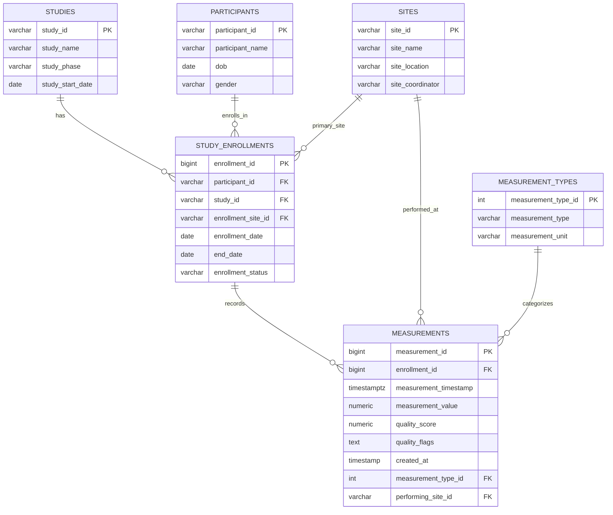

# Data Layer Optimization Proposal

## Overview
The current system stores all measurements in a single denormalized table (~500K rows). With planned growth to 20+ studies, tens of thousands of participants, and 50–100M+ measurements, the infrastructure needs to scale appropriately.

This proposal outlines a path to:
- Improve query performance at scale
- Support future query patterns (participant history, site analytics, longitudinal analysis)
- Maintain data integrity while keeping common dashboard queries fast

---

## Proposed Architecture

### Schema Strategy
Transition from a single wide table to a normalized, analytics-friendly schema:

**Dimension tables:**
- `studies` – study metadata and configuration
- `sites` – site locations and coordinators (only assuming 1 coordinator per site for now.)
- `participants` – participant demographics
- `study_enrollments` – links participants to studies with enrollment context
- `measurement_types` – measurement categories and units

**Fact table:**
- `measurements` – time-series measurement data

**Why this matters:** The current raw table stores almost everything as TEXT, creating scalability and integrity issues:
- Numeric comparisons require explicit casts, slowing down queries
- Bad data sneaks in easily without type validation
- Indexes are less efficient on text-based numeric columns

The normalized schema with proper types (`numeric`, `timestamptz`, etc.) delivers both performance and data integrity improvements.

### Entity Relationship Diagram

### Partitioning
As data grows, consider a strategy where we partition the `measurements` table by `measurement_timestamp` using monthly intervals. Benefits:
- **Partition pruning** – queries filtering by date only scan relevant partitions
- **Smaller indexes** – each partition maintains its own indexes
- **Easier archival** – old partitions can be dropped or archived independently

### Indexing
Key indexes to support common access patterns, e.g.:
- `(enrollment_id, measurement_timestamp)` on `measurements` – participant/study history queries
- `(performing_site_id, measurement_timestamp)` on `measurements` – site analytics
- `(measurement_type_id, measurement_timestamp)` on `measurements` – measurement type trends
- `(study_id)` on `study_enrollments` – study cohort queries

### Pre-Aggregations
Introduce materialized views for high-traffic dashboard queries:
- Quality score distributions per study
- Participant enrollment counts
- Summary statistics by site

These can refresh on a schedule (e.g., every 5–15 minutes) to balance freshness with query load.

### Future Extensions
If time-series workloads dominate, consider:
- **TimescaleDB** – Postgres extension optimized for time-series data
- **Continuous aggregates** – automatic materialized view maintenance
- **Data retention policies** – automated archival of old data

The proposed schema remains compatible with native Postgres and these extensions.

---

## Expected Impact

**Performance:**
- Scales cleanly to tens or hundreds of millions of rows
- Faster analytical queries via partition pruning and indexed lookups
- Pre-aggregated views reduce load on transactional queries

**Data Quality:**
- Stronger type validation prevents bad data at write time
- Foreign key constraints ensure referential integrity
- Reduced duplication minimizes inconsistencies

**Flexibility:**
- Supports participant enrollment across multiple studies
- Enables site-level and longitudinal analysis
- Foundation for future analytics use cases

---

## Tradeoffs

**Complexity:**
- More tables and relationships compared to a single denormalized table
- Some queries require joins through `study_enrollments`
- Dashboard aggregations benefit significantly; participant-level queries involve more joins

**Operational overhead:**
- Partition management (creation, archival) requires automation
- Materialized view refresh adds minor data freshness lag (5–15 minutes)
- Migration from current schema requires planning and validation

---

## Conclusion

This design balances normalization, performance, and operational simplicity. It keeps Postgres as the primary datastore while applying proven techniques—partitioning, proper typing, and pre-aggregation—to support both current dashboards and future analytical needs without over-engineering.
